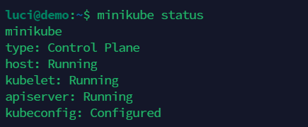
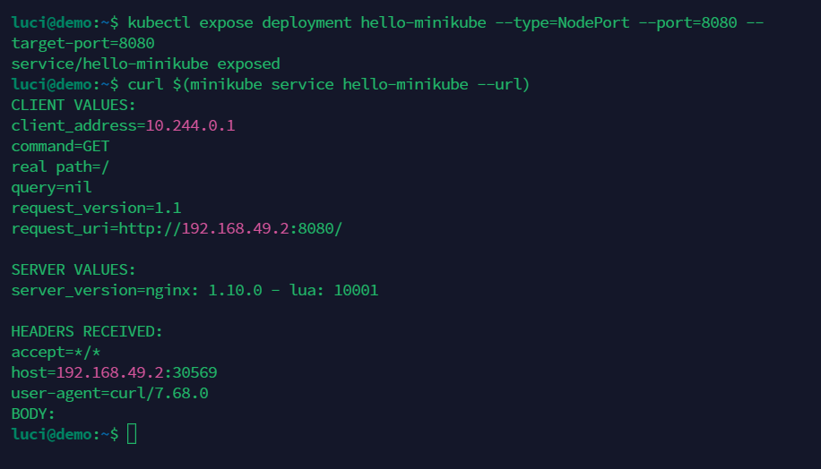

# Minikube Installation on Azure VM _OR_ Locally on Ubuntu Using Docker Driver

## 1. 🖥️💡 Pre-Requirements for Azure VM

- Connect to your Azure VM: Use your preferred method to connect to your Azure VM, such as SSH.
-  The following operating systems are supported:
    - Red Hat Enterprise Linux 8 or Fedora Workstation 34 or later
    - Ubuntu 20.04 LTS or later
    - Microsoft Windows 10
    - macOS 10.15 or later

    ### 🛠️📋 System Requirements 👇👇👇👇👇

    | Attribute   | Minimum Requirements            | Recommended                     |
    |-------------|--------------------------------|---------------------------------|
    | CPU         | 1.6 GHz or faster processor   | Multi-core i7 or equivalent     |
    | Memory      | 8 GB                           | 16 GB or more                   |
    | Disk        | 10 GB free space HDD           | 10 GB or more free space SSD   |


## 2. 🔄 Update package lists
- It's a good practice to update your package lists to ensure you're installing the latest versions of software. Run the following commands:

     ```
     sudo apt-get update && sudo apt-get upgrade -y
    ```

## 3. 🐳 Install Docker
- Minikube requires a container runtime, and Docker is a popular choice. You can install Docker using the following commands:

    ```
    sudo apt-get install -y docker.io
    ```

## 4. 🔑 Add your user to the Docker group
- To avoid having to use sudo every time you want to run Docker commands, add your user to the Docker group:

    ```
    sudo usermod -aG docker $USER && newgrp docker
    ```

## 5. ⚙️ Install Minikube
- Download and install the Minikube binary using curl:

    ```
    curl -LO https://storage.googleapis.com/minikube/releases/latest/minikube-linux-amd64

    sudo install minikube-linux-amd64 /usr/local/bin/minikube
    ```

## 6. ▶️ Start Minikube
- Now you can start Minikube using the desired driver. For example, to start Minikube with Docker as the driver, run:

    ```
    minikube start --driver=docker
    ```

    

## 7. ✔️ Verifying your minikube installation
- Use the minikube status command to validate that the minikube installation is running successfully:

    ```
    minikube status
    ```

    

## 8. ➕ Adding extensions

- minikube comes with the bare minimum set of features. To add more features, minikube provides an add-on based extension system. Developers can add more features by installing the needed add-ons.

- Use the `minikube addons list` command for a comprehensive list of the add-ons
available and the installation status.

    


- Installing the Ingress Add-on. For this course you must install the ingress add-on.
With your cluster up and ready, use the following command to enable the add-on:

    ```
    minikube addons enable ingress
    ```

    


- Installing the Dashboard add-on. The dashboard add-on is not required for this course
 but serves as a visual graphical interface if you are not comfortable with CLI commands.
Enable the dashboard add-on with the following command:

    ```
    minikube addons enable dashboard
    ```

# Will try ad add after


- Once the dashboard is enabled you can reach it by using the `minikube dashboard`
command. This command will open the dashboard web application in your default browser.
Press Ctrl+C in the terminal to finish the connection to the dashboard.

## 9. 🌐 Enabling external access to Ingress

- Some exercises require you to identify the external IP and hostname associated to your Ingress so you can access your application from outside the cluster.

- Routing traffic from your local machine to your Minikube Kubernetes cluster requires two steps.

- First you must find the local IP assigned to your Ingress add on. The minikube ip command is the easiest way to find the ingress IP:

    ```
    minikube ip
    ```

    

- Your IP will probably be different as it depends on your virtual environment
configuration.

- Second, you must declare a hostname for your ingress, and associate the hostname to the ingress IP. For this course, unless the hostname is already in use, you will declare `hello.example.com` as the hostname.

- The association between an IP and a hostname is usually performed by a DNS server,but to avoid registering a domain name to use with Minikube, we can use the system's local name resolution service.

- In Linux and macOS systems, edit the /etc/hosts file with elevated privileges.

    ```
    sudo vim /etc/hosts
    ```

- Add the following line to the bottom of the file and replace `IP-ADDRESS` with the IP address listed in the previous step.

    `IP-ADDRESS` hello.example.com

    


## 10. ⌨️ Installing kubectl in Linux-based systems

- You can install kubectl by downloading the binary and moving it to your PATH. At the same time, it is possible to use a package-manager.

    ### 1. 📦💻 Using curl and the binary file
- Open a command-line terminal to download the kubectl binary


    ```
    curl -LO "https://dl.k8s.io/release/$(curl -L -s https://dl.k8s.io release/stable.txt)/bin/linux/amd64/kubectl"
    ```

- To download a specific version, replace the `$(curl -L -s https://dl.k8s.io/release/stable.txt)`portion of the command with the specific version.

    ```
    curl -LO https://dl.k8s.io/release/v1.29.1/bin/linux/amd64/kubectl
    ```
    ### 2. 🛠️💻 Install kubectl

     ```
    sudo install -o root -g root -m 0755 kubectl /usr/local/bin/kubectl
    ```

- Verify that kubectl has been installed successfully.

    ```
    kubectl version --client
    ```
    

## 11. Using Minikube

  **🛠️ Creating a Deployment :** 
  - A deployment in Kubernetes is a resource that manages a set of identical pods, ensuring that they are always running and available. To create a deployment, you use the `kubectl create deployment` command followed by the name of the deployment and the container image you want to deploy. 

    ```
    kubectl create deployment hello-minikube --image=k8s.gcr.io/echoserver:1.4
    ```
**🚀 Exposing the Deployment as a Service :**

- In Kubernetes, a service is an abstraction that defines a logical set of pods and a policy by which to access them. By exposing a deployment as a service, you make it accessible from outside the Kubernetes cluster. To expose a deployment, you use the `kubectl expose` command

    ```
    kubectl expose deployment hello-minikube --type=NodePort --port=8080 --target-port=8080
    ```
- This command creates a new service named "hello-minikube" of type NodePort, which means it will allocate a port on each node in the cluster and forward traffic to the pods. `The --port and --target-port` flags specify the port the service listens on and the port the pods are listening on, respectively.

**🚪 Accessing the Service :**

-  Once the service is created, you can access it using the allocated NodePort. you can use the `minikube service` command to `get the URL` of the service and then use `curl` to send an `HTTP request` to that URL.

    ```
    curl $(minikube service hello-minikube --url)
    ```
- This command retrieves the URL of the `"hello-minikube"` service using `minikube service hello-minikube --url` and then sends a GET request to that URL using `curl`.

    


# ⭐ Optional

- To delete pods in Kubernetes :

    ```
    kubectl delete pod <pod_name>
    ```
- To delete all pods with a specific label (if you have labeled your pods), you can use:
    ```
    kubectl delete pod -l <label_selector>
    ```
- To delete all pods in your namespace, you can use:
    ```
    kubectl delete pods --all
    ```
 - To delete all pods associated with the deployment:
   ```
   kubectl delete deployment <pod_name>
    ```
- To remove the existing service Example: `"hello-minikube"`: 
    ```
    kubectl delete service hello-minikube
    ```

# 💰 You can help me by Donating


<a href="https://buymeacoffee.com/pasinduljay" target="_blank"></a>
<a href="https://paypal.me/980822" target="_blank">
<br><br>
